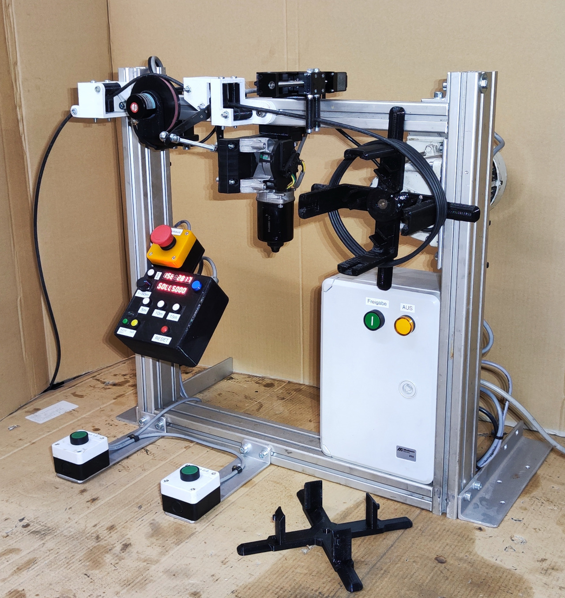

# Overview
Firmware and documentation of a custom built machine that winds and cuts cable to certain lengths.  
Extensive details about this project can be found on the website: [pfusch.zone/cable-length-cutter](https://pfusch.zone/cable-length-cutter)



Photo of the built machine

## Current Features
- Measure length using rotary encoder
- Wind to set length while start-button is pressed
- Automatic wire cutter
- Control interface:
  - 2x 7-Segment display showing lengths and notifications
  - Buzzer for acoustic notifications
  - 4 Buttons and Potentiometer for setting the target length
  - Reset and Cut Button
- Stepper motor controlling a linear axis guiding the cable while winding
- Store last axis position at shutdown


# Usage


# Electrical Details
For detailed documentation of all electrical aspects, see [connection-plan.pdf](connection-plan.pdf).


# Printed Parts
All designed and 3D-printed parts can be found in the [cad/](cad/) folder. These parts were designed using FreeCAD.


# Components
### Custom pcb with ESP-32 microcontroller
See [connection-plan.pdf](connection-plan.pdf)  

### Rotary encoder LPD3806-600BM-G5-24C
```
- Pulses: 600 p/r (Single-phase 600 pulses /R,Two phase 4 frequency doubling to 2400 pulses)
- Power source: DC5-24V
- Shaft: 6*13mm/0.23*0.51"
- Size: 38*35.5mm/1.49*1.39"
- Output :AB 2phase output rectangular orthogonal pulse circuit, the output for the NPN open collector output type
- Maximum mechanical speed: 5000 R / min
- Response frequency: 0-20KHz
- Cable length: 1.5 meter
- size: http://domoticx.com/wp-content/uploads/2020/05/LPD3806-afmetingen.jpg
- Wires: Green = A phase, white = B phase, red = Vcc power +, black = V0
```
### Variable Frequency Drive T13-400W-12-H
See [docs/vfd/](docs/vfd/)

### Stepper-driver TB6600
See [docs/stepper-driver_TB6600-Manual.pdf](docs/stepper-driver_TB6600-Manual.pdf)

### Linear Axis with Nema-12 28HB40 Stepper
See [connection-plan.pdf](connection-plan.pdf)  


# Installation
For this project **ESP-IDF v4.4.4** is required (with other versions it might not compile)
```bash
#download esp-idf
yay -S esp-idf #alternatively clone the esp-idf repository from github
#run installation script in installed folder
/opt/esp-idf/install.sh
```

# Build
### Set up environment
```bash
source /opt/esp-idf/export.sh
```
(run once per terminal)

### Compile
```bash
cd board_single
idf.py build
```

# Flash
- connect FTDI programmer to board (VCC to VCC; TX to RX; RX to TX)
- press REST and BOOT button
- release RESET button (keep pressing boot)
- run flash command:
```bash
idf.py flash
```